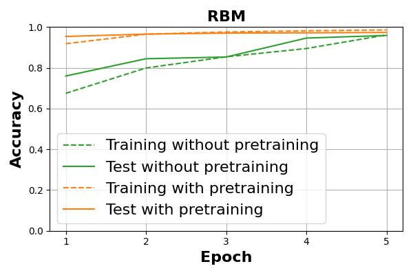
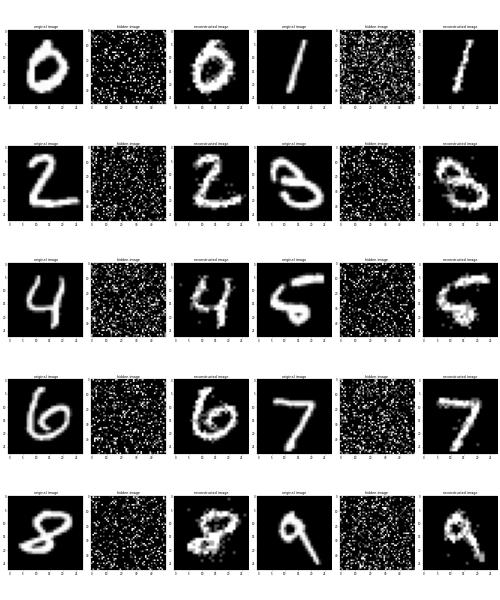

# Energy-Based Models with PyTorch

## Introduction

*Energy-Based Model*, **EBM** is a machine learning method based on the concept of energy in physics.
Examples of EBMs include *Restricted Boltzmann Machine*, **RBM**, and *Deep Belief Network*, **DBN**,
which was introduced by Geoffrey Hinton in 2006, which is known as one of the earliest examples of *Deep Learning*[1].

EBM determines the dependencies between input and latent variables by associating them to real values representing the energy in the system.
This is based on the physical law that a low entropy state gives a better representation of the regularity of the subject of interest.
Thus, EBM is essentially *unsupervised learning*, which can be interpreted as achieving the regularity underlying the subject, i.e., **feature extraction**.
This is one of the basic ideas on which deep learning was established, although in a different form afterwards.

Here, we take the problem of classifying handwritten digits as an example and verify the effect on learning accuracy by employing RBM and DBN to perform feature extraction as **pretraining**.
We also reconstruct images from the trained models in this process to visually confirm how the features underlying the dataset were extracted.

## Restricted Boltzmann Machine

RBM is one of the simplest EBMs consisting of two graphs.
The two graphs are called the *visible layer* and the *hidden layer*, respectively, from the side closer to the input.
Nodes in the visible layer correspond to input variables and nodes in the hidden layer correspond to latent variables.
Nodes in the same graph, i.e. in the same layer, have no connections, while all visible nodes are connected to all hidden nodes and all hidden nodes are connected to all visible nodes. Therefore, the connections between these layers are symmetric and have no direction.
Having no connections in the same graph is what is meant by *restricted*, while allowing the connections in the same graph is *Boltzmann Machine*.
Since the connections are not directional, the computation in RBM is reversible, i.e., it is possible to propagate from latent variables to input variables in the opposite direction of learning. As a consequence, RBM is a *generative model*.

For the dataset, we use MNIST, which provides the problem of classifying handwritten digits from 0 to 9.

First, the classification is performed by *supervised learning* using the smallest *multilayer perceptron*, MLP, which consists of a single hidden layer.
The weights from the input layer to the hidden layer are initialized by random values.
Next, we pretrain the weights from the input layer to the hidden layer in unsupervised learning using RBM,
and assign the weights to the hidden layer of MLP for supervised learning.
Therefore, it is necessary to align the same number of units in the hidden layers of MLP and RBM.
This supervised learning after pretraining is called *fine-tuning*.
We compare and verify the accuracy achieved as a result of each learning process.

The actual progress of accuracy is shown in Figure 1.
It can be seen that higher accuracy is achieved with pretraining.

**Figure 1. Difference in accuracy of MLP with and without pretraining by RBM.**

Figure 2. shows the image of handwritten digits reconstructed with pretrained RBM.

**Figure 2. Reconstructed handwritten digits image with pretrained RBM.**

## Deep Belief Network

Even before *deep learning*, it was known that multilayer neural networks have the potential to learn more complex subjects because they are hierarchical and have many learning parameters.
On the other hand, multilayer neural networks have issues such as *vanishing gradient* and *overfitting*, making it difficult to effectively progress the learning process.

DBN is one of the answers to these problems, where each layer of a multilayered neural network corresponds to RBM,
and unsupervised pretraining is performed in each RBM to extract hierarchical features step by step.
Unsupervised learning is performed in the order from the layer closest to the input, with the visible layer of the RBM closest to the input being directly connected to the input, and the visible layers of the other RBMs being connected to the hidden layers of the RBMs on the side closer to the input.
In this pretrained multilayer neural network is less prone to vanishing gradient and overfitting due to the feature extraction at each stage.
A pretrained MLP with a single RBM can be considered a minimal DBN.

DBN is a *generative model* because they are derived from RBMs, and it is also a *graphical model* in which input variables are represented by the combination of latent variables.

The transition of accuracy achieved by actually training with DBN is shown in Figure 3.
Again, higher accuracy is achieved with pretraining.

**Figure 3. Difference in accuracy of DBN with and without pretraining.**

The image of handwritten digits input reconstructed with pretrained DBN is shown in Figure 4.

**Figure 4. Reconstructed handwritten digits image with pretrained DBN.**

## Applications

As the applications of my work, I applied DBN to a virtual screening for drug discovery in 2014,
and the paper summarizing the results was published in 2017.
A virtual screening based on *Quantitative Structure-Activity Relationship*, QSAR was suitable for early deep learning because it deals with real vectors representing drug candidate compounds as input.

## Reference

- [1] G.E. Hinton et al., *A fast learning algorithm for deep belief nets*, **Neural Computation**, 2006.
